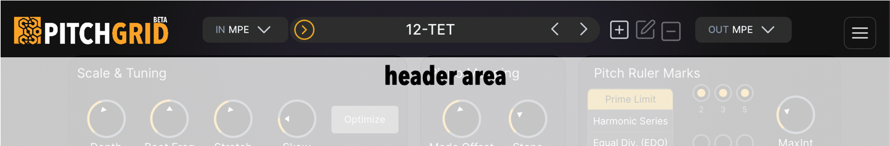
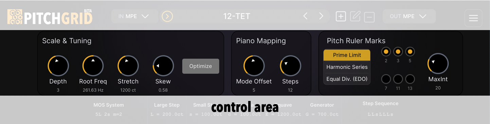
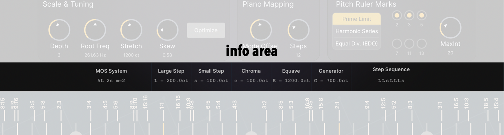
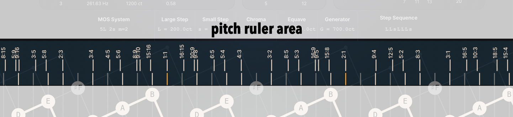
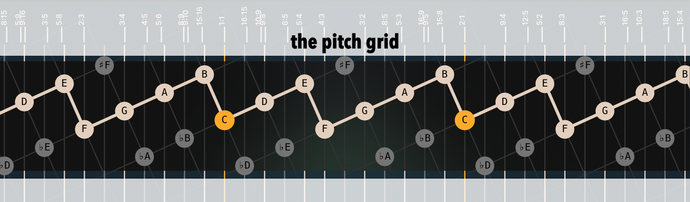
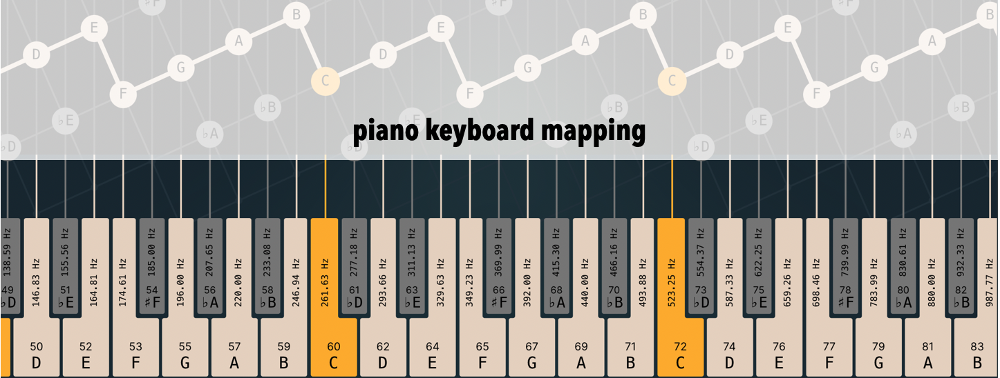

#  PitchGrid Plugin User Manual

_Version: 2026-02-01_

---

## Quick Start

Get PitchGrid running in under 5 minutes.

### 1. Install

- **Download** from [pitchgrid.io/download](https://pitchgrid.io/download)
- **Run the installer** (Windows: .exe, Mac: .pkg)
- **Rescan plugins** in your DAW

### 2. Load in Your DAW

- Create a MIDI track
- Add PitchGrid as a **MIDI effect** (before your synth)
- Add a synth after PitchGrid (any monosynth, or a synth with MPE or MTS-ESP support)
- Adjust your controller's MIDI type in the input section (MIDI or MPE)
- Adjust output pitch bend range of PitchGrid to match the pitch bend range of your synth (when Output mode is not MTS-ESP)

> **[SCREENSHOT NEEDED: PitchGrid in DAW signal chain — Controller → PitchGrid → Synth]**

### 3. Play

- Play some notes — you'll hear standard 12-tone tuning (the default)
- Now turn the **Skew** knob slowly to the left or right
- Listen: the intervals change. You're now in a different tuning system.


### 4. Explore

- Try the **Depth** knob to change how many notes are in your scale
- Try the **Mode/Offset** knob to move the lattice up or down. See note assignments change
- Try the **Steps** knob to adjust how many notes are mapped to the piano-roll
- Load different **Presets** from the dropdown to hear historical and experimental tunings
- That's it — you're using alternative well-formed scales!

---

## What Is PitchGrid?

PitchGrid is a plugin that lets you **explore tuning systems beyond standard 12-tone equal temperament**.

Instead of the equally tuned 12 notes per octave you're used to, you can play scales with any number of notes, while preserving transposability, modes and other familiar features you may know from Western music theory.

### What Makes It Different

Most microtonal tools make you pick from a list of predefined scales or edit individual pitches. PitchGrid takes a different approach:

- **Turn knobs to explore** — the tuning parameters are continuous, like a synth. Sweep through tuning space and hear what sounds good.
- **Structure is preserved** — as you change tunings, you keep the musical structure: modes, transposition, and chord relationships still make sense.
- **Visual feedback** — the grid shows you the pitch relationships, so you can see what you're hearing.

### Why the Piano Keyboard?

You might notice that PitchGrid maps its tunings to the standard piano keyboard. Given that PitchGrid reveals a two-dimensional tonal structure, why map back to the one-dimensional piano layout?

Two practical reasons:

1. **The piano keyboard is everywhere.** It's the most widespread type of controller — most musicians already have one. With PitchGrid, you can play your piano and watch the keys light up on the 2D lattice, seeing the interval relationships directly. And when you venture outside the diatonic scale's tuning range, you can *visually experience* how the piano layout breaks down: the familiar sequence of white and black keys stops making sense. Every scale has its own natural keyboard layout, with black keys falling between the large steps — and the standard piano only gets it right for one scale.

2. **DAWs speak piano roll.** The piano roll is the universal notation system for modern music production. Every DAW uses it. If you want to store, edit, and share your PitchGrid music using existing tools, you need to map to the piano roll — an act of dimensional reduction, but a necessary bridge to the existing ecosystem. The alternative would have been to build an entirely new DAW with a 2D note editor. The mapping is what lets PitchGrid interoperate with the world.

For players who want to *see and play* in 2D, **PitchGrid Mapper** lets you use isomorphic grid controllers where the visual layout matches the scale structure. The signal path is still 2D controller → 1D piano roll → 2D PitchGrid (so your DAW can record), but what you see and feel on the controller is the true geometry of the scale. The piano roll remains the bridge for recording and editing, while your hands work in the natural 2D space.

### Who Is It For?

- Composers looking for fresh harmonic territory
- Electronic musicians who want new sounds
- Players of isomorphic controllers (LinnStrument, Lumatone, Exquis)
- Anyone curious what music sounds like outside 12-tone
- Theorists exploring tuning systems

### Key Features

- **Visual tuning design** — see pitch relationships on an interactive lattice
- **Real-time control** — change tunings while playing; automate parameters in your DAW
- **Full MIDI support** — works with regular MIDI, MPE, and MTS-ESP
- **Preset library** — factory presets for historical and experimental tunings
- **VST3/AU formats** — works in most major DAWs

---

## Installation

### System Requirements

- **OS**: Windows 10/11 (64-bit) or macOS 10.15+
- **CPU**: Intel Core i5 or Apple M1 (or equivalent)
- **RAM**: 4 GB minimum
- **Storage**: 30 MB

### Supported Formats

- **VST3**: Windows and macOS
- **Audio Units (AU)**: macOS only

### Installation Steps

**Windows:**
1. Run the .exe installer
2. Install to the default VST3 folder (`C:\Program Files\Common Files\VST3`)
3. Open your DAW and rescan plugins

**macOS:**
1. Open the .pkg installer
2. Follow the prompts — plugins install to `/Library/Audio/Plug-Ins/`
3. Open your DAW and rescan plugins

### Authorization

On first launch, you'll see a licensing dialog:

- **Trial**: the 14-day trial is in the installer. No credit card — download, run, and play.
- **Activate**: sign in with your Moonbase account to activate this machine (not an Indiekey license key). Existing Indiekey customers sign in with the email on the old license; set a password via [Forgot password](https://pitchgrid.moonbase.sh) if you have not used Moonbase.

---

## DAW Setup

**Important:** PitchGrid is logically a MIDI effect — it transforms MIDI data before it reaches your synth. However, the VST3 standard doesn't have a "MIDI effect" category, so PitchGrid appears as a **virtual instrument** in most DAWs.

This means:
- **In most DAWs** (Ableton, FL Studio, Reaper): Put PitchGrid on its own track and route MIDI through it to your synth on another track
- **In Logic Pro** (AU format): PitchGrid appears as a true MIDI FX and can be inserted directly before your instrument

### Logic Pro (AU — MIDI FX)

1. Create a new **Software Instrument** track
2. In the channel strip, click the **MIDI FX** slot
3. Select **Node Audio → PitchGrid**
4. Add your synth in the **Instrument** slot below
5. If using an MPE controller, set PitchGrid's Input Mode to **MPE**


### Ableton Live (VST3 Instrument — Route Between Tracks)

1. Create a new **MIDI track**
2. Add **PitchGrid** as an instrument on that track
3. Enable MPE Mode for the track with **PitchGrid**
4. Create a second MIDI track with your synth
5. Set both of the synth track's **MIDI From** settings to PitchGrid
6. Enable MPE for the synth track
7. Arm the PitchGrid track; monitor the synth track


### Reaper (VST3 — FX Chain)

1. Create a new track
2. Add **PitchGrid** to the FX chain
3. Add your synth after PitchGrid in the same FX chain
4. Route your MIDI controller to this track


### Cubase

The PitchGrid plugin is reportedly fully functional in Cubase. 

### Studio One

The PitchGrid plugin is reportedly fully functional in Studio One. 

### Bitwig

Bitwig does not support plugins which output MPE. In Bitwig, you can still use MTS-ESP as output, or you can forward the MPE signal from the Standalone app to Bitwig. A CLAP version of the plugin is on the TODO list.

### FL Studio

AFAIK FL Studio does not support MPE.


---

## Interface Guide

The PitchGrid interface has six main areas:

### 1. Header Area



- **Logo**: Click to open this manual
- **MIDI Input menu**: Select input type (Regular MIDI or MPE)
- **Presets menu**: Load and save tunings
- **Preset controls**: New, Save, Delete
- **MIDI Output menu**: Select output type
- **Settings**: Additional options

### 2. Control Area



The main tuning controls:

| Knob | What It Does |
|------|--------------|
| **Depth** | How many notes in your scale (changes structure) |
| **Root Freq** | Base frequency (default 440 Hz) |
| **Stretch** | Expand or compress all intervals proportionally |
| **Skew** | Tilt the tuning — the most important sound-shaping parameter |
| **Mode Offset** | Shift which mode of the scale you're playing |
| **Steps** | How many notes per octave get mapped to your keyboard |

### 3. Info Area



Shows properties of your current scale:

- **MOS System**: Number of large (L) and small (s) steps
- **Large Step / Small Step**: Size of each step in cents
- **Accidental**: Interval for adding a sharp or flat to a note, in cents (always equals L minus s)
- **Generator**: The interval that generates the scale structure; in diatonic scales, this is the perfect fifth
- **Equave**: The interval where the scale repeats (usually octave = 1200 cents)
- **Step Sequence**: The pattern of large and small steps (e.g., LLsLLLs for major)

### 4. Pitch Ruler



The vertical ruler on the right shows reference pitches:

- **Prime Limit**: Just intervals (simple frequency ratios like 3:2, 5:4)
- **Harmonic Series**: Overtones of a fundamental
- **Equal Divisions**: EDO steps (12-TET, 19-TET, etc.)

Use this to see how close your tuning is to pure intervals.

### 5. The Grid



The central visualization:

- **Yellow nodes**: Root note and its octave equivalents
- **White nodes**: Other notes in your scale
- **Grey nodes**: Off-scale notes (accidentals)
- **Zig-zag path**: Your current scale, connecting adjacent scale degrees

The grid is a window into an infinite, regularly-tuned 2D lattice of pitches. This window shows which notes get mapped to your keyboard. It's oriented so that the same scale degree in different octaves lines up horizontally. Moving from one scale degree to the next means moving up or down (corresponding to the two step sizes), which creates the zig-zag pattern you see.

### 6. Piano Mapping



Shows how notes map to a standard MIDI keyboard:

- Each key displays its note name and pitch
- Colors match the grid (yellow = root, white = scale, grey = off-scale)
- The piano keyboard layout specifically matches C Major with 12 steps per octave — other scales and settings won't align with the white/black key pattern

---

## Common Workflows

### "I want to try a different equal temperament"

**Goal**: Tune the diatonic scale to 19-EDO instead of 12-EDO.

1. Start with the default **12-TET** preset
2. In the **Pitch Ruler Marks** section, select **Equal Div.** (EDO)
3. Set the **Steps** parameter in the Pitch Ruler area to **19**
4. Click the **C** below the "19\19" pitch mark label to mark it for optimization
5. Click another note from the first octave for optimization (e.g., the **E** near the "6\19" mark)
6. Click the **Optimize** button
7. Observe how the pitches of the mapped notes now align with 19-EDO pitch ruler marks
8. *Optional*: To make all 19 pitches playable, set the **Steps** parameter in the **Piano Mapping** section to **19**

**Note**: Not all EDOs work with the diatonic scale structure. EDOs compatible with the diatonic structure include 7, 12, 17, 19, 22, and 31. Other MOS scale structures support different EDOs.

**Tip**: The factory preset "19-TET" does this automatically.

### "I want just intonation"

**Goal**: Tune intervals to pure frequency ratios.

1. Start with any preset
2. In the **Pitch Ruler Marks** section, select **Prime Limit** 
3. Configure the primes and the **MaxInt** parameter
4. The ruler now shows just intervals (3:2, 5:4, etc.)
5. Select **Snap to Ruler Marks** from the Snapping section in the settings menu
6. All mapped notes snap to the nearest just ruler mark
7. Play with **Skew** and **Mode Offset** parameters until the desired pitches are available in your scale

**Note**: The snapping feature destroys strict regularity of the lattice. Therefore, the scale's intervals may sound differently when played in another key.

### "I want to use my LinnStrument / isomorphic controller"

**Goal**: Play PitchGrid scales on a grid controller with proper layout.

1. Download [PitchGrid Mapper](https://github.com/pitchgrid-io/pitchgrid-mapper/releases) (free, open source)
2. Run PitchGrid Mapper - (follow the steps in the [PitchGrid Mapper documentation](/info/PitchGridMapper))
3. In PitchGrid plugin, enable **OSC output** (Settings menu)
4. Configure your Track with PitchGrid to receive input from "PitchGrid Mapper"
5. Your controller now shows the scale layout with lit pads for scale tones

See the [PitchGrid Mapper documentation](/info/PitchGridMapper) for details.

### "I want to automate tuning changes"

**Goal**: Change tunings during a track using DAW automation.

1. In your DAW, open the automation lane for the PitchGrid track
2. PitchGrid exposes all parameters: Skew, Stretch, Depth, Steps, etc.
3. Draw automation curves — the tuning changes in real-time as the track plays

**Example**: Automate Skew from 0.5 to 0.7 over 8 bars for a gradual tuning drift.

---

## MIDI Configuration

### Input Modes

**Regular MIDI**
- Standard note on/off with global pitch bend
- Works with any MIDI keyboard
- Set **Pitch Bend Range** to match your controller (usually ±2 semitones)

**MPE (MIDI Polyphonic Expression)**
- Per-note pitch bend, pressure, and slide
- For expressive controllers: Seaboard, LinnStrument, Continuum
- Set **Input Pitch Bend Range** to match your controller (often ±48 semitones)

### Output Modes

| Mode | Description | Use When |
|------|-------------|----------|
| **None** | No MIDI output (visualization only) | Testing/exploring |
| **Mono** | Single channel with pitch bend | Simple setups, mono synths |
| **Poly** | Multiple channels (up to 16 voices) | Polyphonic non-MPE synths |
| **MPE** | Full MPE output | MPE-capable synths |
| **MTS-ESP** | Tuning data via MTS protocol | Multi-plugin tuning sync |

### Signal Flow

```
Your Controller
      ↓
  [MIDI In to DAW]
      ↓
  [PitchGrid Plugin]
      ↓
  [Retuned MIDI/MPE Out]
      ↓
  [Your Synth]
```

PitchGrid receives standard MIDI and outputs retuned MIDI with pitch bend data that makes your synth play the correct microtonal pitches.

---

## Presets

### Factory Presets

PitchGrid includes presets for common tunings:

| Preset | Description |
|--------|-------------|
| **12-TET** | Standard Western tuning (default) |
| **Pythagorean** | Pure fifths (3:2), historical tuning |
| **1/4-Comma Meantone** | Pure major thirds, Renaissance standard |
| **19-TET** | 19 equal steps, smooth and bright |
| **31-TET** | 31 equal steps, excellent just approximations |
| **Just Intonation 5-limit** | Pure intervals from the 5-limit |
| **Bohlen-Pierce** | Non-octave scale based on 3:5:7 |

### Saving Your Own

1. Adjust parameters to taste
2. Click the **Save** icon in the header
3. Name your preset
4. It appears in the User section of the preset menu

### Preset Contents

Presets store:
- All tuning parameters (Depth, Skew, Stretch, Steps, etc.)
- Mode offset
- Root frequency

Presets do NOT store:
- MIDI input/output settings
- Window size

---

## Understanding the Theory (Optional)

This section explains the concepts behind PitchGrid. **You don't need this to use the plugin** — but if you're curious about why it works the way it does, read on.

### Why Tuning Theory Exists

There's a fundamental tension in music between two desirable properties:

**Justness**: Intervals sound most consonant when their frequencies form simple ratios. A perfect fifth (3:2) sounds pure because the third harmonic of one note matches the second harmonic of the other. The simpler the ratio, the stronger the consonance.

**Regularity**: Music relies on repetition and transposition. We want to play a melody in different keys and have it sound "the same." This requires intervals to be consistent throughout the scale.

The problem: **you can't have both perfectly.** A scale built entirely from just intervals won't transpose cleanly. A perfectly regular scale (like 12-TET) sacrifices some justness.

Every tuning system is a compromise between these two goals.

### The PitchGrid Approach

Traditional tuning theory starts with just intervals and then "tempers" them (adjusts them slightly) to achieve regularity.

PitchGrid inverts this: **start with a regular structure, then see which just intervals it approximates.**

This has a practical advantage: regular scales can be controlled with continuous parameters. Turn a knob, and all the pitches shift together while maintaining their structural relationships.

### MOS Scales

The scales PitchGrid works with are called **MOS scales** (Moments of Symmetry), discovered by theorist Erv Wilson.

A MOS scale has exactly two step sizes (Large and Small), distributed as evenly as possible. The number of large and small steps must not share a common divisor — so 5L 2s works, but 4L 2s wouldn't (both divisible by 2). Examples:

- **5L 2s**: The familiar diatonic scale (major, minor, modes)
- **2L 5s**: Inverted diatonic
- **3L 4s**: "Mosh" — a 7-note scale with different character
- **7L 5s**: 12-note chromatic (when tuned to 12-TET)

The Western diatonic scale is just one MOS among infinitely many. PitchGrid lets you explore the others.

### The Two Dimensions

Why is PitchGrid a 2D grid?

Because MOS scales have two step sizes, they naturally live on a 2D lattice:
- One axis = Large steps
- Other axis = Small steps

This is also why standard music notation has two components: staff position (the 7 diatonic notes) and accidentals (sharps/flats). F# and Gb are different points on the lattice — they only collapse to the same pitch in 12-TET.

Isomorphic controllers (LinnStrument, Lumatone) are ideal for these scales because they're also 2D grids.

### Glossary

| Term | Meaning |
|------|---------|
| **Cents** | Logarithmic pitch unit; 100 cents = 1 semitone in 12-TET |
| **EDO** | Equal Division of the Octave (e.g., 12-EDO = 12-TET) |
| **Equave** | The interval where a scale repeats (usually octave, but can be other ratios) |
| **Generator** | The interval used to build a MOS scale (e.g., fifth for diatonic) |
| **Just Intonation** | Tuning based on simple frequency ratios |
| **MOS** | Moment of Symmetry — a scale with two step sizes, evenly distributed |
| **Temperament** | A tuning system where some intervals are adjusted from just |

---

## Notable Scales

Here are some historically important and experimentally interesting scales you can create in PitchGrid, with exact parameter values.

### Western Diatonic Scales (5L 2s)

These all use the familiar 7-note scale structure — 5 large steps and 2 small steps.

| Scale | Depth | Skew | Stretch | Character |
|-------|-------|------|---------|-----------|
| **12-TET** | 5L 2s | ~0.583 | 1.0 | Standard Western tuning. The default. |
| **Pythagorean** | 5L 2s | ~0.585 | 1.0 | Pure fifths (702.0ct). Bright, medieval. |
| **1/4-Comma Meantone** | 5L 2s | ~0.579 | 1.0 | Pure major thirds (386.3ct). Renaissance organs. |
| **19-TET** | 5L 2s | ~0.579 | 1.0 | 19 equal steps. Smooth, close to meantone. |
| **31-TET** | 5L 2s | ~0.581 | 1.0 | 31 equal steps. Excellent just approximations. |

*Tip: Load the 12-TET preset, then slowly turn Skew to hear the transition between these tunings.*

### Beyond Western (Different Scale Structures)

Use **Depth**, **Stretch**, and **Skew** together to explore scales with different numbers of notes and interval structures.

| Scale | Depth | Notes | Character |
|-------|-------|-------|-----------|
| **Pentatonic** | 2L 3s | 5 | The "black keys." Universal folk scale. |
| **Mavila** | 2L 5s | 7 | Inverted diatonic. Pelog-like, gamelan feel. |
| **Porcupine** | 7L 1s | 8 | 8 notes, unusual thirds. |
| **Orwell** | 4L 5s | 9 | 9 notes, good 7-limit approximations. |
| **Bohlen-Pierce** | 5L 4s | 9 | Non-octave scale (repeats at 3:1). Alien but consonant. |

*For Bohlen-Pierce: Set Stretch so the equave is ~1902ct (a perfect twelfth, ratio 3:1).*

### Creating These Scales

1. **Load a preset** if available — this sets all parameters
2. **Or dial manually**: Set Depth first (this changes the scale structure), then adjust Skew (this changes the tuning)
3. **Watch the Info Area** — it shows the step pattern (e.g., "LLsLLLs") and interval sizes in cents
4. **Use the Pitch Ruler** — set it to show just intervals, then adjust Skew until scale notes align with the ruler marks

---

## Experiments to Try

The best way to understand PitchGrid is to play with it. Here are some exercises:

### 1. Hear the Difference Between Tunings

1. Load **12-TET** (the default)
2. Play a major chord (root, major third, fifth)
3. Now load **1/4-Comma Meantone**
4. Play the same chord — notice the third sounds smoother, more "at rest"
5. Load **Pythagorean** — the fifth is purer, but the third is sharper

*What you're hearing: the tradeoff between just intervals.*

### 2. Sweep Through Tuning Space

1. Start with any preset
2. Play a sustained chord or drone
3. Slowly turn **Skew** from one extreme to the other
4. Listen: intervals expand and contract. Some settings sound consonant, others tense.

*The "sweet spots" are where intervals align with or are close to just ratios.*

### 3. Change the Scale Structure

1. Start with 12-TET (5L 2s diatonic)
2. While holding a chord, change **Depth** to 7L 5s (chromatic)
3. Now try 2L 3s (pentatonic)
4. Notice: the same keys now play different notes in the scale

*Depth changes how many notes exist; Skew changes how they're tuned.*

### 4. Automate a Tuning Drift

1. Record a simple chord progression or loop
2. Open automation for the **Skew** parameter
3. Draw a slow curve over 16 bars
4. Play back — the tuning gradually shifts throughout the progression

*This creates a sense of harmonic motion that's impossible in fixed tuning.*

### 5. Find Your Own Scale

1. Set **Depth** to something unfamiliar (try 3L 4s or 4L 3s)
2. Play random notes — find combinations that sound good to you
3. Adjust **Skew** until the intervals feel right
4. Save as a preset — this is now your scale

*There are no wrong answers. Trust your ears.*

---

## Advanced Features

### MTS-ESP Integration

MTS-ESP lets multiple plugins share a tuning.

1. Set PitchGrid's Output Mode to **MTS-ESP**
2. PitchGrid becomes the tuning "master"
3. Other MTS-ESP-compatible plugins receive the tuning data
4. All your instruments play in the same tuning

Useful for orchestral or layered sounds where multiple synths need to match.

### OSC Output

PitchGrid can send tuning data via OSC to companion applications.

1. Enable **OSC output** in the Settings menu
2. The plugin broadcasts scale and tuning information
3. Currently supported: **[PitchGrid Mapper](/info/PitchGridMapper)** — for visualizing scales on isomorphic controllers

This is a beta feature; the protocol may change in future versions.

---

## Troubleshooting

### Plugin doesn't appear in DAW

- Rescan plugins in your DAW's preferences
- Check that you installed the correct format (VST3 for Windows, AU for Logic)
- On Mac, check System Preferences > Security if the installer was blocked

### No sound

- Check MIDI routing: Controller → PitchGrid → Synth
- Make sure Output Mode is not set to "None"
- Verify your synth is receiving on the correct MIDI channel

### MPE not working correctly

- Set Input Mode to **MPE**
- Match the **Input Pitch Bend Range** to your controller's setting
- Ensure your DAW has MPE mode enabled for the track

### Grid appears blank or frozen

- Try Window > Reset View in the plugin menu
- Update your graphics drivers
- Restart the plugin

### High CPU usage

- Reduce **Depth** to lower values
- Disable OSC if not using it
- Close the network visualization if active

### DAW-Specific Issues

**Ableton Live**: PitchGrid must route to another track; Live doesn't support MIDI effects directly on instrument tracks.

**Logic Pro**: Use the MIDI FX slot, not the Instrument slot.

**Bitwig**: Only works with **MTS-ESP mode** due to Bitwig's internal handling of MPE and pitch bend. Standard MIDI/MPE output modes are not compatible.

### Getting Help

- Documentation: [pitchgrid.io](https://pitchgrid.io)
- Email: peter@pitchgrid.io
- Community: [PitchGrid Discord](https://discord.gg/Cuspq2RKj3)

---

## Licensing

### Trial

- 14 days, full functionality
- No credit card, no watermarks or limitations during trial
- The trial is in the installer — download, run, and play

### Full License

- One-time purchase from [pitchgrid.io/download](https://pitchgrid.io/download)
- Perpetual license with free updates for version 1.x

### Activation

1. Launch PitchGrid in your DAW
2. Sign in with your Moonbase account to activate this machine
3. Existing Indiekey customers: use the email on the old license; set a password via [Forgot password](https://pitchgrid.moonbase.sh) if you have not used Moonbase

To free a paid seat on this machine, use **Revoke device activation** in Account & License (or the same action in the Moonbase licenses overview).

---

## Legal

© 2025-2026 Node Audio and Peter Jung. All rights reserved.

PitchGrid is a trademark of Peter Jung. This software is provided under license; see the [EULA](/plugin-eula) for terms.

VST is a trademark of Steinberg. Audio Units is a trademark of Apple. All other trademarks are property of their respective owners.

---

*For the latest version of this manual, visit [pitchgrid.io/info/plugin-user-manual](https://pitchgrid.io/info/plugin-user-manual)*
